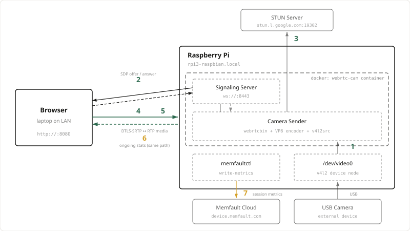

# gst-webrtc-camera-demo

A minimal, **plaintext (no-TLS)**, **receive-only** WebRTC live-view demo: a Raspberry Pi
streams a USB camera to a browser on the same LAN, using GStreamer's `webrtcbin`.

This is a small fork of the WebRTC example from the **GStreamer monorepo**
(`gstreamer/gstreamer`, `subprojects/gst-examples/webrtc`), vendored at commit
`75fe368278d4`. Only the camera-demo pieces are included: the signalling server, the Python
sendrecv app, and the JS browser client.

> **Not a production architecture.** No TLS on signalling or page delivery, no authentication
> on the signalling server, everything on one device, single-LAN. These are deliberate
> simplifications for teaching. See "Security" below.

## What was changed vs. upstream (2 patches)

| Commit | Change | Why |
|---|---|---|
| `js: derive websocket scheme from page protocol` | Build the signalling URL as `ws://` for an http page, `wss://` for https, instead of hardcoding `wss://`. | Upstream hardcodes `wss://`, so a plaintext http deployment can't connect. |
| `js: support receive-only viewing over plain http` | Default constraints to `{video:false,audio:false}` and skip `getUserMedia` (returning a null stream, guarded in `createCall`). | An IP-camera view captures nothing in the browser. `navigator.mediaDevices` is `undefined` in an insecure (http) context, so the stock code crashes; receive-only sidesteps it and removes any need for TLS. |

Both are general improvements worth sending upstream. The Python sender is **unmodified**
from upstream — everything it needs is already baked into the Docker image.

## System Architecture



Numbered labels are the metrics recorded per session (see "Memfault Session Metrics"
below); solid arrows are the primary direction, dashed arrows are the return path. The
dashed boundary is the `webrtc-cam` Docker container — `memfaultctl` and the `/dev/video0`
device node are host-level, mounted into the container rather than running inside it.

## Prerequisites

This demo requires the browser and Pi to be on the **same LAN** — WebRTC media is
peer-to-peer, and the signalling server only brokers the initial connection setup, so a LAN
keeps things simple with no relay infrastructure needed.

**On the Pi:**
- Docker installed.
- The image built once (see "Running it" below) — there's no registry, so a fresh clone
  needs one `docker build` before `start.sh` works.
- A USB webcam with [v4l2](https://en.wikipedia.org/wiki/Video4Linux) support, plugged in
  (see below — almost all USB webcams qualify).
- *(Optional, but highly recommended)* `memfaultd` configured — see "Memfault Session
  Metrics" below.

**On your desktop:**
- A browser on the same LAN as the Pi (tested with Firefox; any modern browser with WebRTC
  support should work).

### Checking your webcam supports v4l2

Almost all USB webcams do. To confirm on the Pi:

```bash
sudo apt install v4l-utils   # if not already installed
v4l2-ctl --list-devices
```

You should see your camera listed with one or more `/dev/videoN` nodes underneath it (a
single camera commonly exposes more than one — `/dev/video0` is usually the capture node).
Then confirm it offers a usable capture format:

```bash
v4l2-ctl -d /dev/video0 --list-formats-ext
```

Look for `MJPG` or `YUYV` in the output — either works with this demo. If the camera doesn't
show up in `--list-devices` at all, it isn't v4l2-compatible (rare for USB webcams) or isn't
plugged in.

## Running it

Build the image once (skip if you've already done this):

```bash
docker build -t webrtc-cam .
```

Then, from the Pi:

```bash
./start.sh
# or: ./start.sh --keep-alive   (see "Keep-alive mode" in Additional Info)
```

From a browser on another LAN machine, open **one URL** — the fragment pre-fills the peer id
and ticks "remote offerer" (so the Pi sends the offer with its camera):

```
http://<pi-hostname-or-ip>:8080/#peer-id=camera1,remote-offerer=1
```

Click **Connect** and the camera feed should appear. (Manual equivalent: open
`http://<pi>:8080/`, type `camera1` in "Enter peer id", tick **Remote offerer**, click
**Connect**.) Starting the stream is always an explicit click — nothing auto-connects.

When you're done:

```bash
./stop.sh
```

## Memfault Session Metrics (Optional, but highly recommended)

The camera sender includes optional Memfault instrumentation that records per-viewing
session metrics: a segmented time-to-first-frame (TTFF) breakdown and ongoing streaming
quality stats. Measuring this is a core part of the point of this demo — if memfaultd is
not installed, the sender still works identically, but you won't get that visibility.

### Setup

1. Install memfaultd on the Pi host (see [Memfault Linux docs](https://docs.memfault.com/docs/linux/introduction)).

2. Add the `live-view` session to `/etc/memfaultd.conf`. This block is the only
   demo-specific addition — `project_key`, `software_version`, `software_type` and
   `enable_data_collection` are baseline memfaultd configuration covered by the docs
   above, and memfaultd will not report without them. The metric names here must match
   what the sender emits; a metric the sender sends that is not declared here is
   silently dropped.

```json
{
  "sessions": [
    {
      "name": "live-view",
      "captured_metrics": [
        "negotiation_setup_ms",
        "signaling_rtt_ms",
        "ice_ms",
        "dtls_ms",
        "media_start_ms",
        "ttff_total_ms",
        "video_bitrate_kbps",
        "rtt_ms"
      ]
    }
  ]
}
```

3. Restart memfaultd:

```bash
sudo systemctl restart memfaultd
```

4. Run `./start.sh` — it will detect memfaultd and mount the CLI into the container
   automatically.

5. **Force an upload before checking the dashboard.** memfaultd batches by default —
   `upload_interval_seconds` is commonly 3600 or 7200 — so a session you just recorded
   will sit on the device for up to that long. Nothing is wrong; it simply has not
   shipped yet. After a session:

```bash
memfaultctl sync
```

   Without this step the usual first experience is an empty dashboard and the conclusion
   that the instrumentation is broken.

   While developing, `"enable_dev_mode": true` in `/etc/memfaultd.conf` is worth setting:
   it relaxes rate limiting so rapid back-to-back sessions are not dropped. Turn it off
   for anything resembling a fleet.

### Verifying it works

Session metrics are written by `memfaultctl` and the periodic gauges go out over StatsD
to `127.0.0.1:8125`, so neither appears in `docker logs`. To confirm end to end:

```bash
# 1. The sender logs each segment as it computes them
sudo docker logs $(sudo docker ps -q) 2>&1 | grep "TTFF"

# 2. Push to the cloud, then look for a live-view session on the device timeline
memfaultctl sync
```

A successful session prints all six TTFF segments. If `memfaultctl` is missing from the
container the sender still streams normally and logs nothing — that is the intended
no-op behaviour, not a failure.

### Metrics recorded

**TTFF segments** (one-time per session, written at session end):

| Metric | Measures |
|---|---|
| `negotiation_setup_ms` | Pipeline startup + offer creation (t0 to offer created) |
| `signaling_rtt_ms` | Signalling path round-trip (offer sent to answer received) |
| `ice_ms` | NAT traversal (answer received to ICE connected) |
| `dtls_ms` | DTLS-SRTP handshake (ICE connected to peer connected) |
| `media_start_ms` | First outbound RTP observed (peer connected to first RTP packet) |
| `ttff_total_ms` | Device-side total (t0 to first RTP packet sent) |

`t0` is set when the sender receives `OFFER_REQUEST` from the signalling server —
the moment the camera is asked to begin a viewing session. Everything before that
(page load, websocket connect, `SESSION` handshake) is outside these metrics, as is
everything after the sender emits its first RTP packet (network transit, the
viewer's jitter buffer, decode and render).

**Streaming quality** (sampled every 2s via StatsD, aggregated by Memfault over the session):

| Metric | Source |
|---|---|
| `video_bitrate_kbps` | Outbound video throughput |
| `rtt_ms` | Network round-trip time from RTCP receiver reports |

The sender deliberately emits only these two. Earlier revisions also sent
`video_framerate`, `video_packets_sent` and `video_nack_count`; they were dropped
because cumulative packet counts are MTU-dependent and not actionable on their own,
and because `frames-encoded` / `nack-count` are optional fields this `webrtcbin`
does not populate — they were silently never recorded.

## Additional Info (Optional)

### Configuration

`start.sh` covers the normal case. For anything else, these env vars (set via `docker run -e`
or by editing `docker-compose.yml`) control the container:

| Var | Default | Meaning |
|---|---|---|
| `OUR_ID` | `camera1` | id the sender registers under (the browser calls this) |
| `VIDEO_ENCODING` | `vp8` | `vp8`, `h264` (software x264enc), or `av1` |
| `SOURCE` | `--camera` | `--camera` = USB cam via `autovideosrc`; empty = test pattern |
| `SIGNALLING_PORT` | `8443` | signalling ws:// port |
| `HTTP_PORT` | `8080` | static client http port |

### Keep-alive mode

By default the sender builds its GStreamer pipeline when a viewer asks for a stream and
tears the whole thing down when they leave — and the sender process itself exits between
viewers, so the next one pays full startup again. Passing `--keep-alive` to `start.sh` sets
`KEEP_PIPELINE_ALIVE=1` in the container and changes that:

```bash
./start.sh --keep-alive
```

Concretely, keep-alive does four things:

1. **The camera stays open.** `v4l2src` holds `/dev/video0` from container start, so the
   sensor never re-initialises between viewers.
2. **The encoder stays running.** The source pipeline stays in `PLAYING` permanently (ending
   in a `tee` that tolerates having no viewer attached), so only `webrtcbin` and one queue
   are added/removed per session.
3. **The sender process persists.** It loops internally instead of exiting, so one-time
   per-process costs (GStreamer registry/plugin load, `webrtcbin` init) are paid once at
   startup rather than per viewer.
4. **A keyframe is forced when a viewer attaches**, so they don't wait up to
   `keyframe-max-dist` frames for a decodable picture from an encoder that's been running
   the whole time.

**When not to use it.** Keep-alive trades power for latency: the sensor and encoder run
continuously whether or not anyone is watching, which is fine on a mains-powered camera and
usually wrong on a battery-powered one. It also holds the camera open permanently, so on
hardware with an activity LED tied to the sensor, that indicator stays lit. The first viewer
after a restart doesn't benefit — the savings begin with the second.

### Security

"Plaintext" here means the **signalling** (SDP + ICE over `ws://`) and the **page delivery**
(`http://`) are unencrypted and unauthenticated. It does **not** mean the video is
unencrypted: WebRTC media is always DTLS-SRTP encrypted end-to-end — that is mandatory in the
protocol and cannot be turned off. What's exposed is the signalling channel: on a trusted LAN
with these disclaimers that's fine; in production you would run `wss://` + auth on signalling.

### Remote Access

This demo only supports same-LAN viewing. Reaching it from a different network would need a
[TURN](https://en.wikipedia.org/wiki/Traversal_Using_Relays_around_NAT) relay server to
forward media through NAT — out of scope here, but if you outgrow the LAN case, that's the
piece to add (e.g. [coturn](https://github.com/coturn/coturn)), configured via the
`stun-server`/`turn-server` properties on the `webrtcbin` element in `webrtc_sendrecv.py`.

### License

Inherited from upstream gst-examples — see `LICENSE`.
